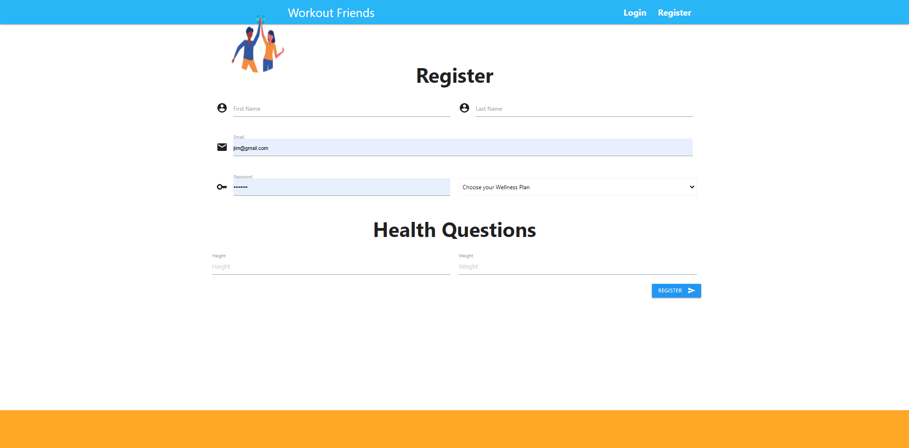
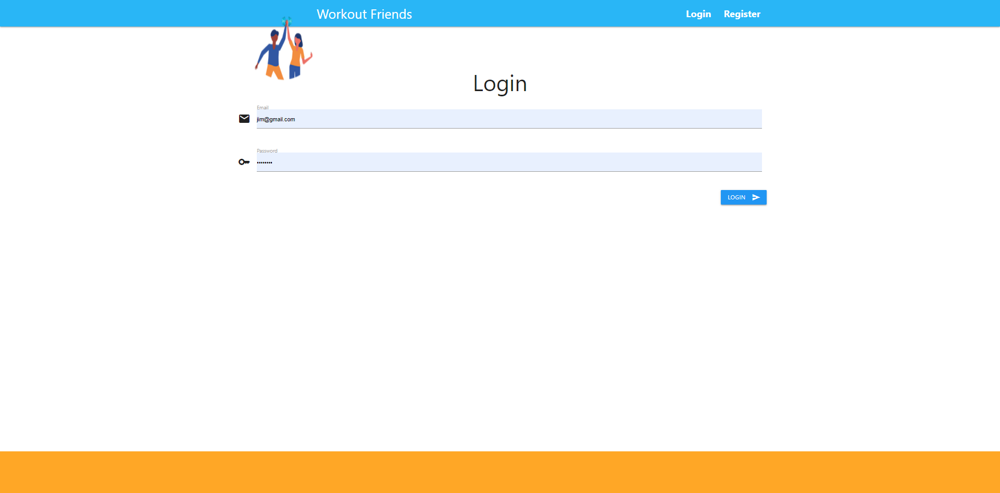

# Workout Friends 

## Brief Description 📖
   A social media workout platform

## Table of Contents 💡
   * [Brief Description](#description)
   * [About Workout Friends](#about)
   * [Installation](#install)
   * [Usage](#usage)
   * [Testing](#test)
   * [Screenshots](#screenshots)
   * [Demo Video](#demo)
   * [Github Pages Link](#pages) 
   * [Github Repo Link](#repo)
   * [Contact Details](#contact)
   * [License](#license)
   * [Contributions to Repo](#contributions)
   * [Additional Information](#info)

## About Workout Friends 
   Social media platform for morale and success in working out with different task and routines assigned depending workout plan that was chosen
   
## Installation 🏗️
   npm i
 
## Usage 📝
   node server.js   
      
## Testing 
   npm test

## Screenshots 📷
   
   
   

    
   
## Demo Video 
   <a href="" target="_blank">----==== YouTube.com Video Link (with audio) ====----</a>
    
    

   
        
## Github Pages Link 
   <a href="https://bkturner1220.github.io/Workout-Friends" target="_blank">https://bkturner1220.github.io/Workout-Friends</a>
   
## Github Repo Link 
   <a href="https://github.com/bkturner1220/Workout-Friends" target="_blank">https://github.com/bkturner1220/Workout-Friends</a>
     
## Contact Information 
   Github Username: [bkturner1220](https://github.com/bkturner1220/) 
   Github: <a href="https://github.com/bkturner1220/">https://github.com/bkturner1220/</a> 
   Email: <a href="mailto:bturner@texascdlprep.com">bturner@texascdlprep.com</a>
   
## License Information 
 
   The application is covered under MIT license.
   
## Contributions towards Workout Friends 🏆
   SMU Coding Bootcamp, Gabe L' Herault, Christian Gonzalez
         
## Additional Information 
   If you encounter any problems, please feel free to reach out to me by sending me a [Email] to <a href="mailto:bturner@texascdlprep.com">bturner@texascdlprep.com</a>.
